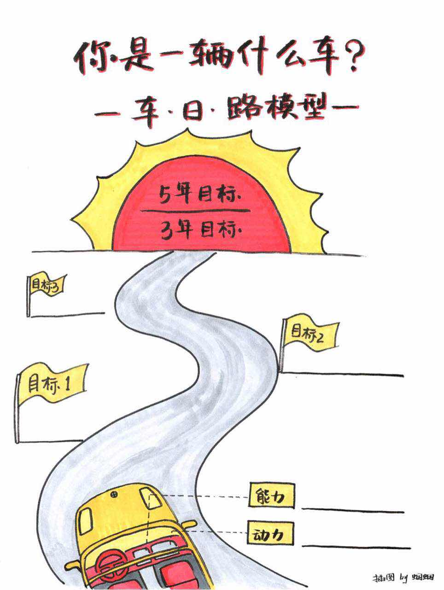

#### 一：车日路模型
##### 车意味着自我概念（法拉利、奔驰、越野车、自行车、卡车）
##### 身边坐的人往往是你做决策时很重要的人（家人、朋友、自己）
- 开往的目的地（现阶段的目标）
- 路径是你希望经过的路径。

#### 二：观点
##### 一个号的职业发展计划由三个部分组成
* 目标
* 自我
* 路径

<!-- more --> 
> 解读：

>1：日是你要去的地方和目标。职业发展是什么，五年目标是什么，三年目标、一年目标是什么？哪些在前哪些在后
>
> 2：路是你要走的路径，对于如何去最近的拿表，路径是否清晰，分成哪几部，如果不清晰，去向谁请教
> 
3：车是你自己，你对自己的能力是否有信心，如果需要提升，提升的是什么，动力来自哪里，通过什么来持续对自己进行升级*加油*

#### 三：策略

* 升级车：出入职场，从目标出发，主要任务就是学习和成长，从自己身上开始开刀和自己死磕，持续增值。
* 选好路：发展中期，宁可一思进，不可一思停，持续升级自己的车和驾驶技术，只要打方向不错，总会开到目的地【取势、优术、明道】
* 做自己：从自身出发，去想去的地方，走自己最合适的路。

#### 四：思考
- 你是辆什么车，要去哪里，准备如何去？
- 你现在处于什么阶段，会选择3个策略的哪个策略？升级车？选好路？还是做自己？

