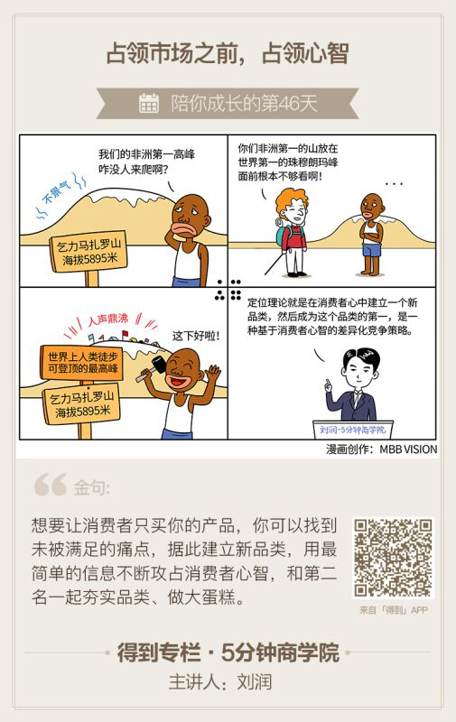

> 本周的主题讲得是营销。这个时代，无论对于公司还是个人，营销都显得至关重要。对于公司来讲，公司的影响力或者说是产品的影响力直接影响到公司的利润，而对于个人来讲个人的影响力则直接影响到个人的在行业、在公司的地位以及收入等要素。

#### 如果说商业是一场战争，渠道就是地面部队，它的最高任务是堵门，用最优性价比，在一场又一场巷战中，抢占所有与消费者之间的触点。而营销，就是空中部队，它的最高任务是洗脑，利用“国军节节败退，我军又下一城”的炮弹，全面攻占消费者大脑，写入“只能买我”四个字。

<!-- more --> 
`定位理论`

>定位理论就是，不能成为品类第一，就创造一个新品类

#### 定位理论有效的基础，是消费者的5大心智模式：
- 第一，消费者只能接收有限的信息；
- 第二，消费者喜欢简单，讨厌复杂；
- 第三，消费者缺乏安全感；
- 第四，消费者对品牌的印象不会轻易改变；
- 第五，消费者的心智容易失去焦点。

##### 运用定位理论的四个建议：

* 从消费者心智出发，不要从产品出发
* 要去填充消费者的心智，而不是腰包。关注消费者的买点，而不是卖点。所以心智是主战场
* 基于这个没有被满足的需求，或者通电，创立一个干净的品类。
* 占领消费者认知的武器，也就是信息，要极度简单。
* 欢迎竞争。

#### 小结：

##### 定位理论，就是在消费者心中建立一个新品类，然后成为这个品类的第一。
##### 具体四个步骤。
- 第一，找到未被满足的痛点；
- 第二，据此建立新品类；
- 第三，用最简单的信息不断攻占消费者心智；
- 第四，和第二名一起夯实品类，做大蛋糕。 

>说到底，定位，是一种基于消费者心智的差异化竞争策略。

#### 问题：

*你可以怎么来运用这个观念，分四步，给自己差异化的优势呢？*

#### 思考：

##### 前两天看古典老师讲个人能力萃取中有个方法就是：讲一件你的确做得并不错的事，萃取出一个不明觉厉的名词—XX能力，让大家理解这是什么能力，告诉或者暗示大家，它对于你的新领域有什么用。这个方法和定位理论真的是大同小异。对自己做的不错的事情进行定位以及包装，建立一种品类第一，用最简单得理论占据大家的心智。学到这一课，对古典老师的课程的理解也更深入了。

