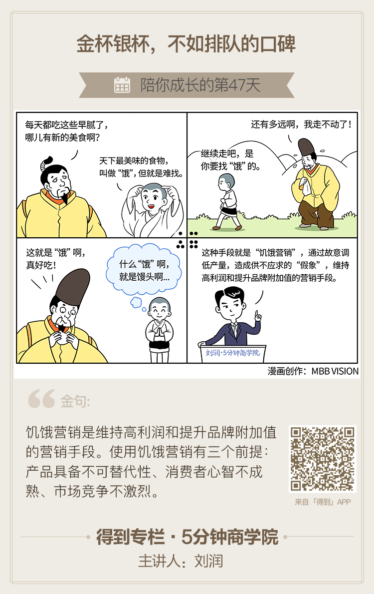

#### 概念

> 饥饿营销就是，通过故意调低产量，造成供不应求的“假象”，维持高利润和提升品牌附加值的营销手段。

##### 它的本质，是“边际效用”理论在营销领域的应用。看上去饥饿营销的目的，是通过严格控制产量，让供给端始终远小于需求端，产生供不应求的假象，把消费者“饿”晕，然后抬高价格，获得暴利。但实际上，因为饥饿本身也限制了销量，所以利润未必大。所以，饥饿营销真正目的，不是为了利润，而是为了品牌附加值。
<!-- more --> 
##### 案例一：上海一家特难定的高档参订，案例二：《聪明的一休》最美味的美食--饿；

#### 运用

##### 案例：王阿婆每天500个茶叶蛋，爱马仕经典包款：Birkin和Kelly

#### 小结：使用前提和副作用

##### 使用饥饿营销有三个前提，产品具备不可替代性、消费者心智不成熟、市场竞争不激烈。
##### 饥饿营销也有不少的副作用，值得注意。第一，客户流失。过度饥饿营销，就是将客户“送”给竞争对手。第二，顾客反感。过度饥饿营销，会让消费者饿到冷静，觉得被愚弄，对品牌产生厌恶。
#### 思考：
#####    在手机领域里做饥饿营销最好的应该就是小米了，在小米1发布之时就深有体会。不过那时的市场环境以及产品形态和现今不同，当时市场在1999价位，小米手机是没有任何竞争对手的，甚至在3000价位也有得一拼，这样也大大的超出了用户的预期，所以越是一机难求却越是吸引大众，然而现在小米产能也有所提升，品牌也已经深入人心，并且现在小米的价位已经是个红海市场，如果继续饥饿营销吧，只怕会输的很惨。不过今年的mix的出现，又让小米饥饿了一把，可见好的产品，即便是饥饿却让其更出彩，由此可见饥饿营销在很大程度上也算是口碑营销的。

