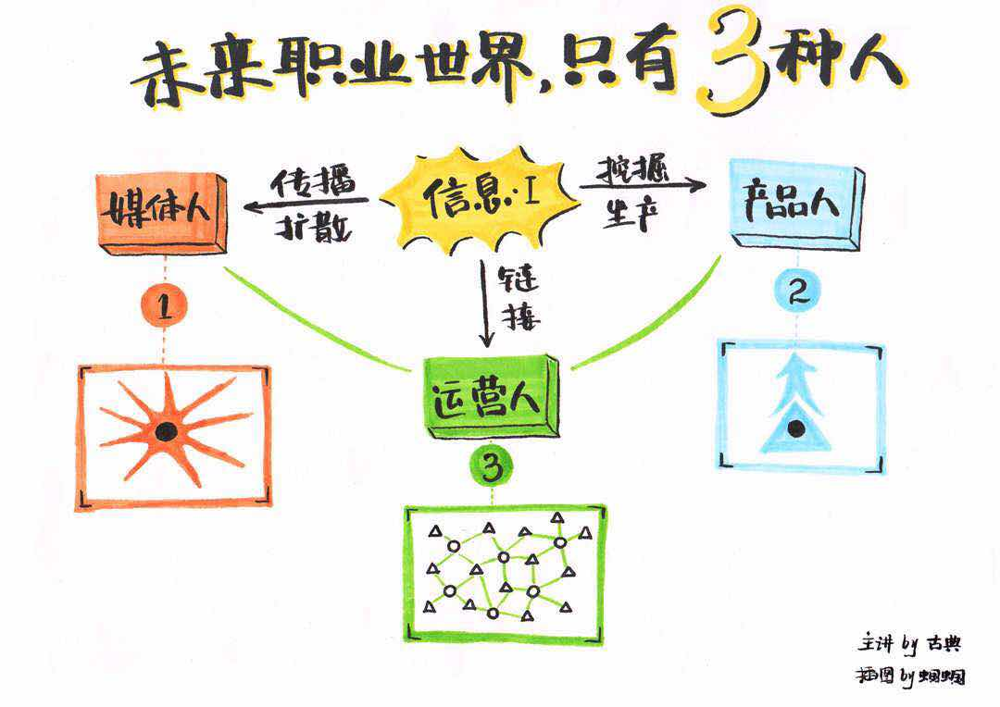

### 问题
#### “行业-企业-职业”这个模型失效，行业不断被跨界，职业不断的变化，所以会觉得很慌即：一会觉得自己的职业什么都能干，一会又觉得谁都能威胁你。

### 观点
#### 今天的社会和原始社会不同，本质上来说是物质排列的方式不同
<!-- more --> 
#### 人类社会的进步，科技和商业的进步就是一个信息量增加的过程。

> 企业的核心功能也是信息的生产，营销，推广

#### 一个人最习惯的处理信息的方式，也就决定了你自己的职业路径和职业类型

* 第一种人的想法是把信息传播出去，持续的做传播的动作，信息对于他，产生了更多的链接
* 第二种人会搜索更多的信息，不断增加自己的信息量，慢慢的会成为一个专业人士
* 第三种人会找到更多专家生产会更多的信息，找到更多的传播者传播更多的链接，他们之间怎么沟通呢?这就是运营人。

#### 所以媒体人下意识的传播，产品人下意识寻求更多的信息，运营人会下意识的链接两者

- 媒体人的核心是不断的扩散信息的能力
- 产品人的核心是产生信息的能力
- 运营人的核心能力是链接的能力

### 策略
#### 我们会常有一个误区，会羡慕身边人的能力，你越明确自己是哪种人，处于哪条赛道，我们就越能够不做无谓的比较，而聚焦一下自己的方向
#### 另一方面这个分类也能帮助你看到这个领域里面更多的高手

### 精进
- 你收到新的信息的时候，你自己如何处理，你最擅长哪一种？你是哪一种人？
- 大部分的职位都是三者的混合，但是你职位的本质是生产、传播还是运营信息？
- 如果你的优势进一步在你的工作里发挥，你会做些什么？

