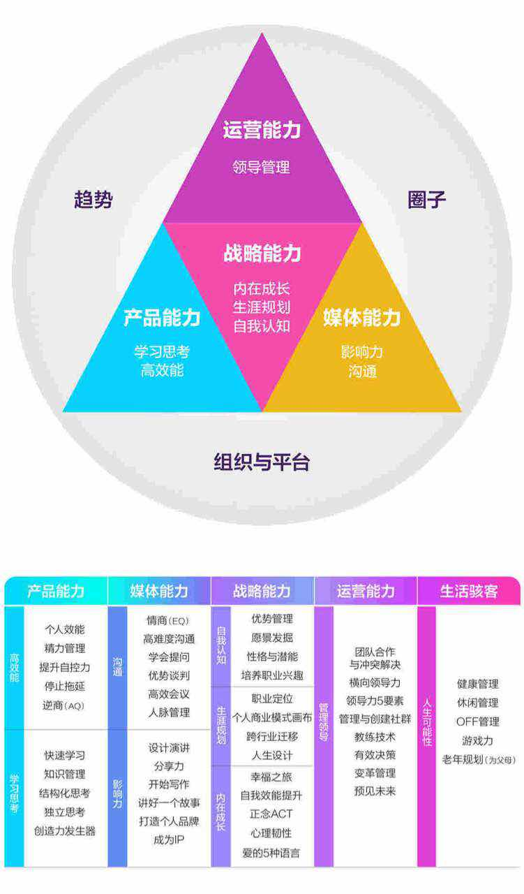

> 焦虑是人类面对威胁，希望创造自我的正常状态。
————罗洛梅（心理学家）


#### 金句:
```
敏感才能感到变化，有才华才会有的选，追求自由才想要把握自己的人生。
```

#### 成长加速的三个要素：

-  转换模式
- 应用新工具和技术
- 持续学习，提高素质

<!-- more --> 
#### 未来能够在职场中领跑的人:
- 有一门极致的专业能力，优秀的基本素质，并持续自我升级
2. 有自己的个人品牌和影响力，通过多种方式交换价值
3. 善于同不同的公司，组织合作
4. 内心强大，拥抱不确定性，自己掌控发展方向
需要做的事情：


>重新理解新的职业模式，学会应用互联网和社交媒体，升级自己的各项职业技能，以及持续的学习和时间，抓住趋势，成为一个“超级个体”*


#### 把自己当成一家公司的话，核心能力由四部分组成：
* 产品能力（对事的竞争能力）
* 媒体能力 （对人的影响力）
* 运营能力（对组织的领导力）
* 战略能力（自己的成长）



