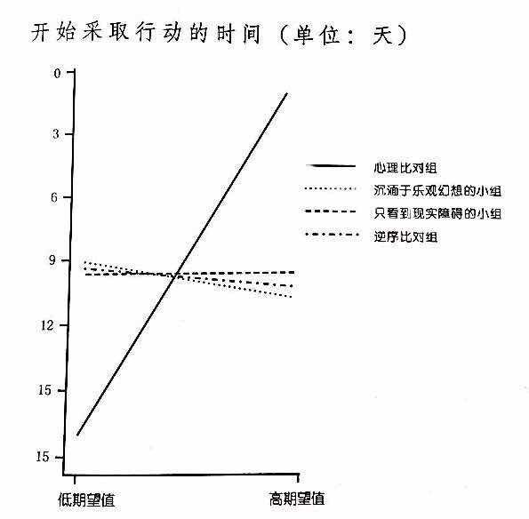

#### 今天的分享是主题是四种梦想模式，来检验梦想的可行性。当然文中也提到了其他的三种模式：消极现实，乐观幻想，逆序对比。

#### 概念
##### 加布里埃尔·厄廷根提出：既然积极幻想的麻烦是不行动和不考虑障碍，那么直接在梦想以后增加一个对于障碍的评估，会不会增加行动和成功的概率呢？
<!-- more --> 
##### 心理派对的实验：在德国柏林的2所大学找到168名女学生，让他们幻想自己最大的愿望来排序评估，并且每个人都写出4个有关实现愿望的积极个观点的词语和4个消极障碍的词语，然后分为四组：

- 心理对比组 先想积极，再消极
- 乐观幻想组 只想积极
- 消极现实组 只想消极
- 逆序对比组 先想消极，再想积极

##### 通过实验发现是心理对比组占优。

##### 心理对比之所以起作用，因为通过预演未来回答了一个问题，这个事情我又机会成功吗？如果答案是”是“,这群人投入的时间和行动力比所有的组都高。如果不是，这群人投入的干劲则比一般人还要低。并且心理预期解决了2个最常见的问题：1：光想不动，2,三分钟热度。

> 人在追求梦想的时候，力量是最大的。但并不是随便的一种，而是过去经历评估过自己行得通的一种    ———  厄廷根 

##### 成功学为什么不靠谱

- 放大了乐观、预期和梦想 ，短期减压，长期降低了行动了。
- 为突出大师的厉害，放大了个体的可能性，弱化消极显示
- 鼓励人们不顾一切追寻自己的梦想。

#### 策略
---
#### 心理对比：

##### 下次遇到定计划，思考梦想的时候，按照顺序思考这些问题：
- 你的期待是什么？
- 在当前的情况下，你期待最好的结果是什么？
- 在当前的情况下，最大的显示障碍是什么？

> 看见就是改变的额开始，行动才是改变的抵达。

##### 例子：
看完这个专栏的人是65%，看完心理咯噔一下走了心得比例不知道，但是留言的人呢平局是300条（2%），留言完开始行动或者转述的估计是其中的三分之一100人（0.7%）,持续行动到有改变的估计只有三分之一，33个人。
<!-- more --> 
#### 总结

##### 4种梦想模式：心理对比，消极现实，乐观幻想，逆序比对。

##### 心理比对，能让我们聚焦我们真正有能力大成，放下自己无力达成的。

当你理解了心理比对的作用，你可以更深刻的理解三分钟热度和成功学激励的原理。

#### 精进

- 觉察下你的心智模式--- 你通常属于‘消极显示’、“乐观幻想”、“逆序对比”还是“心理比对”？
- 列出3个你最期待发生的目标（乐观幻想），列出3个最大的显示障碍，用10分钟完成心理比对，然后给这三个目标排序--- 哪个才是你更加有干劲的梦想。

