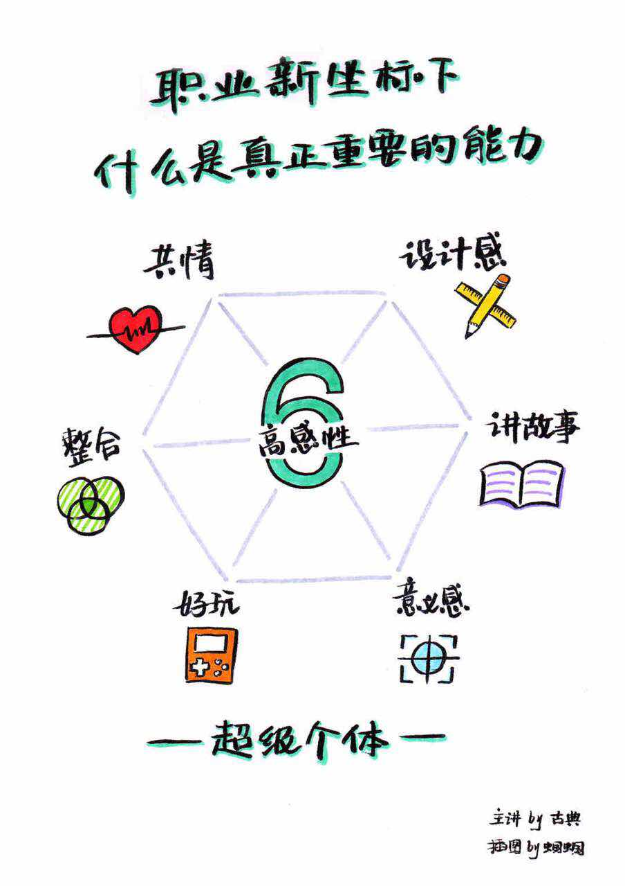

### 观点
#### 世界已经从过去的高理性时代，进入一个高感性和高概念的时代，有6种能力是非常重要且稀缺的。
---
* 设计感
* 设计师一种计谋，让事情得以推进。是一种新的解决方式，让事情得意顺利进行
* 共情能力
* 站在别人的角度思考，甚至思考的比人更深入的能力。
* 讲故事
* 这个不用说了吧
* 整合
* 行业不断跨界，领域不断变化，最强的不是总在从头学习，而是持续整合自己的人
* 娱乐感
* 让你觉得好玩的能力
* 意义感
* 一个人自我领导和领导他人的能力
<!-- more --> 
#### 意义：
- 设计感和讲故事—产生影响力
- 共情能力、整合能力和好玩 —— 提高竞争力
- 意义感 —— 自我驱动和领导他人

### 策略
---
#### 今天这个时代，最厉害的是懂人性又懂电脑的人，真正的赢家就是一个能用高感性能力跟高科技合作的人。

### 精进
---
- 你是哪个行业的？近两年来，技术和互联网对于你的行业最大的变化是什么？
- 在你看来，有哪些行业，职业或者工种正在慢慢的消退，哪些在变得越来越值钱？为什么？
- 设计感、共情能力、讲故事、整合、娱乐感。意义感，这些能力在你的行业领域内有什么应用？

